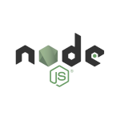
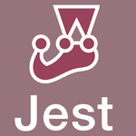

# Michael Chan - Junior Developer

[About Me](#about_me) || [Tech stack](#tech_stack) || [Projects](#projects) || [Skills](#skills) || [Work Experience](#work_experience) || [Past Education](#past_education) || [Others](#others)

[My CV](./resources/CV%20-%20Michael%20Chan%20(Cheuk%20Yu%20Chan).pdf)

## <a name="about_me">About me 💁‍♂️ </a>
I have always been fascinated with technology, I love online shopping, I love travelling with GPS and Google Map, I love video calls or gaming with friends living in another continent. I believe technology has a great potential to improve our lives. That is why after I moved from Hong Kong to the UK in January 2022, I decided to explore tech as my new career.  Joining the highly-selective bootcamp in [Makers](https://makers.tech/) for 16 weeks confirmed my career change. 

I am an aspiring junior full-stack developer. I look forward to the journey working in the tech industry, applying my knowledge, skills and strengths to become a better full-stack developer.

### Languages 🗣️
- English
- Cantonese Chinese (Native proficiency)
- Mandarin Chinese (daily conversation)
- Japanese (I am learning it!)

## <a name="tech_stack">Tech Stack 🔧</a>  

&nbsp;&nbsp;&nbsp;&nbsp;&nbsp;&nbsp;&nbsp;&nbsp;&nbsp;&nbsp;&nbsp;&nbsp;&nbsp;&nbsp;&nbsp;&nbsp;&nbsp;&nbsp;&nbsp;&nbsp;&nbsp;&nbsp;&nbsp;&nbsp;&nbsp;&nbsp;&nbsp;&nbsp;&nbsp;&nbsp;&nbsp;&nbsp;&nbsp;&nbsp;&nbsp;&nbsp;

--------
- Javascript (Node.js, Express, Jest, React, React Native)
- Ruby (Sinatra, Ruby on Rails, RSpec, Capybara)
- SQL (PostgreSQL)
- MongoDB (MongoDB Atlas, Mongoose)
- HTML, CSS (Bootstrap)
- Heroku
- Git, GitHub
- Other tools: TablePlus, Postman

## <a name="projects">Projects 💻</a>
### Group Projects from Makers Bootcamp 🔋

| Name              | Description       | Time frame | Tech/tools   | URL   |
| ----------------- | ----------------- | ---------- | ------------ | ----- |
| **Loyal Bean**    | Two mobile applications (for independent coffee shop owners and customers respectively) to replace physical loyalty cards | 10 days | React Native, Node.js, Express, MongoDB Atlas, Heroku, Android Studio, XCode | https://github.com/michaelcychan/bean-app   https://youtu.be/J0zqN5dgz1s |
| **AceBook** | An experimental Facebook clone | 10 days | MongoDB, Express, Node.js, Handlebars, Jest, Cypress | https://github.com/michaelcychan/acebook-node-priceless |
| **MakersBnB** | An AirBnB clone that allows users to list spaces that they have available and to hire spaces for the night | 5 days | Ruby, Sinatra, RSpect, PostgreSQL | https://github.com/michaelcychan/MakersBnB |

### Personal Projects / Exercises 🔋

| Name              | Description       | Tech/tools   | URL   | Status  |
| ----------------- | ----------------- | ------------ | ----- | ------- |
| **Village Doctor**   | A web application built for an imaginary village shaman doctor and villagers to make appointments and purchases | MERN (React, Node.js, Express, MongoDB), Jest | https://github.com/michaelcychan/village-doctor | Ongoing |
| **Bank Tech Test**   | A tech test exercise simulating bank account transactions and statement printing | Node.js, Jest | https://github.com/michaelcychan/bank-tech-test | Finished |
| **Mock Blog API**   | A tech test exercise simulating a blog site | Ruby on Rails, CSS | https://github.com/michaelcychan/posts-api | Finished |
| **Coding Process Review** | A coding process review by a professional reviewer | Javascript, Jest | [Scorecard](./resources/CodingProcessReviewComment.md) | Finished |

## <a name="skills">Skills 🏹</a>

### Self-initiative and self-directed learner
I worked as an Immigration Officer in Hong Kong for the past decade. For more than four years, I worked as a non-technical member in a team which was responsible for maintaining and developing the internal computer systems. I had to be adaptable and self-learn the basic life-cycle of software development. Although I was not required to learn any technical aspects or programming language, I found it useful to learn the basic SQL so that I could ensure an effective communication with the internal and contractor programmers, that was also essential for me to assist the system users to write the User Stories when they wanted to have an upgrade of the application. 

My team used React Native, which was not included in the Makers official curriculum, in the Engineering Project III in the Makers bootcamp. I used my self-directed learning skill, together with my team, to learn and apply the newly learnt languages to build two mobile applications and successfully tested them on physical devices.

### Communication, empathy, and construtive team player
During the Makers bootcamp, I pair programmed almost every day. We had 3 group projects. I used my communication skills to complete our tasks by learning together and overcoming obstacles. When there was a knowledge spectrum across the groups, I listened to what obstacles my partners had and tried to progress together as a team. 

When I worked in the team with programmers and system users, I always had to use my communication skills to understand the needs of the system users, assist them to write User Stories, and to explain to the programmers who did not have experience or full understanding of the users' daily operations. I also needed to explain system constraints to users and assist them to adjust the scope of possible system change. 

When I was tasked with asylum claim assessments, I frequently interviewed the asylum claimants who were often in distress. I used my communication skills and empathy to build up rapport with them so that they can give their evidence to support their claims as best as they could.

### Attention to details and analytical skills
In the Makers bootcamp, I had coding sessions reviewed by independent external reviewers. In the latest review on 11 July 2022, I was commented as "reasoned well and justified all the decisions [I] made regarding [my] algorithm. Even when stuck, [I] still justified and reasoned every attempt that [I] made at a solution to the non-compliant test."

In my job as Immigration Officer to assess asylum claims, I used my attention to details and analytic skills in my frequent communication with their legal representatives and my research of the submitted evidence and the relevant Country of Origin Information. 

### Time management and prioritising
In the Engineering Projects in Makers bootcamp, I always used time management skills to build web applications in relatively limited time with my team using the newly learnt skills. My team and I always had to make decisions on which tasks should be completed first. We also had to prioritise different features, bug fixes, or learning new techs for the project.

When I worked as an Immigration Officer to assess asylum claims, I usually had around 8 to 10 cases of different stages under my care. I used my time management skills to arrange interviews, conduct research on cases, write decisions, and to handle appeals of asylum claimants within the pledge timeframe. I had to use my time management skill to finish all tasks on time.

## <a name="work_experience">Work Experience 💡</a>

**Hong Kong Government** (Dec 2010 - Dec 2021)  
_Immigration Officer_

***Removal Assessment Section*** (Apr 2017 - Dec 2021)

- Using communication skills and empathy to conduct interviews with asylum claimants, their legal representatives and interpreters concering their asylum claims
- Using self-learning skills and analytical skills to assesse the asylum claims basing on the legal submissions from the claimants and their legal representatives, individual researches on the Country of Origin Information, and relevant laws.

***Systems Support (APPLIES) Section*** (Feb 2013 - Apr 2017)

- Using communication skills to maintain an effective point of contact and resolve conflicts among internal programmers, contractor programmers, and internal computer system users (other immigraiton staff) to ensure daily operation of the internal computer system responsible for visa application and registrations of persons (APPLIES)
- Collecting new User Stories from different sections to upgrade the application 
- Assisting User Acceptance Testsh and updating system manuals before any system change or upgrade rollout
- Overseeing an internal system between Immigration Department and the Hospital Authority and Department of Health which check the eligibity of government's subsidised healthcare service

***Airport Control Section*** (Jul 2011 - Feb 2013)

- Conducting interviews with arrival passengers, examining their travel documents and other relevant documents or belongings, and making contacts with the local connections to investigate whether they satisfied the immigration requirements
- Assisting genuine passengers especially in connection to their immigration issues

***Training Camp*** (Dec 2010 - Jul 2011)

**Dr Clement Tong Dental Clinic - Hong Kong** (Jan 2010 to Nov 2010)  
**Health & Care Dental Clinic - Hong Kong** (Oct 2008 to Jul 2009)  
_Associate Dentist_

- Providing oral examination and dental treatments to clients
- Understanding clients' needs and discussing possible treatment plans to the clients

## <a name="past_education">Past Education 📚</a>

**Makers Academy** (May - Aug 2022)  
_Coding Bootcamp_

- Object-Oriented Programming, Test-Driven Development, Pair Programming
- Ruby (Sinatra, RSpec)
- JavaScript (Node.js, Express, Jest)
- MongoDB, PostgreSQL
- Agile (Scrum, Kanban)

**Baptist University of Hong Kong - Hong Kong** (Sep 2012 to Jun 2014)

- Master's in Arts and Culture

**University of Hong Kong - Hong Kong** (Sep 2003 to Jul 2008)

- Bachelor's in Dental Surgery

## <a name="others">Hobbies 🎵</a>

Apart from coding, I like  
- Playing the cello (ABRSM Grade 7 with merit (Oct 2004))
- Reading manga (A recent one I really like is _The Heroic Legend of Arslan (アルスラーン戦記)_)
- Lego